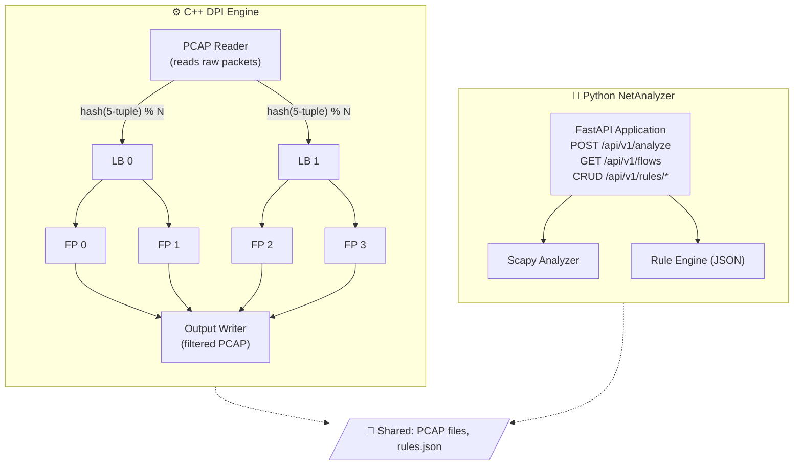

<p align="center">
  <h1 align="center">🛡️ DPI Platform</h1>
  <p align="center">
    <strong>High-Performance Deep Packet Inspection Engine + REST API</strong>
  </p>
  <p align="center">
    <a href="#-quick-start"></a>
    <a href="#-api-reference"></a>
    <a href="#-architecture"></a>
    <a href="LICENSE"></a>
  </p>
</p>

---

A complete network traffic analysis platform that combines a **multi-threaded C++ DPI engine** with a **Python FastAPI REST service**. Upload PCAP captures, classify applications via TLS SNI extraction, enforce blocking rules, and generate detailed traffic reports — all containerized with Docker.

| Component | Language | Purpose |
|-----------|----------|---------|
| **DPI Engine** | C++17 | Multi-threaded packet parsing, flow tracking, SNI extraction, rule enforcement |
| **NetAnalyzer** | Python 3.11 | REST API for PCAP uploads, rule management, flow queries |
| **Docker** | YAML | One-command deployment of both services |

---

## 📑 Table of Contents

- [Quick Start](#-quick-start)
- [Architecture](#-architecture)
- [How It Works](#-how-it-works)
- [Project Structure](#-project-structure)
- [C++ Engine](#-c-engine)
- [Python API (NetAnalyzer)](#-python-api-netanalyzer)
- [API Reference](#-api-reference)
- [Docker Deployment](#-docker-deployment)
- [Building from Source](#-building-from-source)
- [Configuration](#-configuration)
- [Testing](#-testing)
- [License](#-license)

---

## 🚀 Quick Start

### Option 1: Docker (Recommended)

```bash
# Clone the repository
git clone https://github.com/Izhaar-ahmed/DPI-platform.git
cd DPI-platform

# Start the API service
docker compose up -d netanalyzer

# Analyze a PCAP file via the API
curl -X POST http://localhost:8000/api/v1/analyze \
  -F "file=@test_dpi.pcap"

# Run the C++ engine directly
docker compose run --rm dpi-engine /data/test_dpi.pcap /output/result.pcap \
  --block-app YouTube
```

### Option 2: Build Locally

```bash
# Build the C++ engine
cmake -B build && cmake --build build

# Run analysis
./build/dpi_engine test_dpi.pcap output.pcap --block-app YouTube --block-domain tiktok

# Start the Python API
cd netanalyzer
pip install -r requirements.txt
uvicorn app.main:app --host 0.0.0.0 --port 8000
```

---

## 🏗 Architecture



### Threading Model

The C++ engine uses a **pipelined, multi-threaded architecture**:

| Stage | Thread(s) | Responsibility |
|-------|-----------|----------------|
| **Reader** | 1 | Reads PCAP, hashes 5-tuple, dispatches to LBs |
| **Load Balancers** | N (default 2) | Distribute packets to Fast Paths via consistent hashing |
| **Fast Paths** | M (default 2 per LB) | DPI processing: SNI extraction, classification, rule matching |
| **Output Writer** | 1 | Writes allowed packets to the output PCAP file |

> **Consistent hashing** ensures all packets from the same connection (5-tuple) are always routed to the same Fast Path thread — enabling correct stateful flow tracking without locks.

---

## 🔍 How It Works

### Deep Packet Inspection in 4 Steps

```
  ┌──────────────────────────────────────────────────────────────┐
  │ 1. PARSE — Peel protocol layers                              │
  │                                                              │
  │    ┌─────────────┐                                           │
  │    │  Ethernet   │ → MAC addresses, EtherType                │
  │    │  ┌────────┐ │                                           │
  │    │  │  IPv4  │ │ → Source/Dest IP, Protocol, TTL           │
  │    │  │ ┌────┐ │ │                                           │
  │    │  │ │TCP │ │ │ → Source/Dest Port, Flags, Seq Numbers    │
  │    │  │ │┌──┐│ │ │                                           │
  │    │  │ ││TLS│ │ │ → Client Hello → SNI hostname             │
  │    │  │ │└──┘│ │ │                                           │
  │    │  │ └────┘ │ │                                           │
  │    │  └────────┘ │                                           │
  │    └─────────────┘                                           │
  ├──────────────────────────────────────────────────────────────┤
  │ 2. TRACK — Group packets into flows using the 5-tuple        │
  │    (src_ip, dst_ip, src_port, dst_port, protocol)            │
  ├──────────────────────────────────────────────────────────────┤
  │ 3. CLASSIFY — Extract SNI from TLS Client Hello              │
  │    "www.youtube.com" → AppType::YOUTUBE                      │
  ├──────────────────────────────────────────────────────────────┤
  │ 4. ENFORCE — Check rules → FORWARD or DROP the entire flow   │
  └──────────────────────────────────────────────────────────────┘
```

### SNI Extraction

Even though HTTPS traffic is encrypted, the **TLS Client Hello** message contains the destination hostname in plaintext (the **Server Name Indication** field). This is the key that enables application-level classification:

```
TLS Record:
  Content Type: 0x16 (Handshake)
  └── Handshake Type: 0x01 (Client Hello)
      ├── Version, Random, Session ID …
      └── Extensions:
          └── SNI Extension (type 0x0000):
              └── "www.youtube.com"  ← extracted!
```

The engine also extracts the `Host:` header from plaintext HTTP traffic.

### Flow-Based Blocking

Blocking operates at the **flow level**, not the individual packet level:

```
Packet 1  (SYN)            → No SNI yet → Forward
Packet 2  (SYN-ACK)        → No SNI yet → Forward
Packet 3  (Client Hello)   → SNI: youtube.com → BLOCKED!
Packet 4+ (all subsequent) → Flow marked blocked → Drop
```

Once a flow is classified and matches a blocking rule, **all subsequent packets** in that connection are dropped.

---

## 📁 Project Structure

```
DPI-platform/
│
├── include/                          C++ Headers
│   ├── pcap_reader.h                  PCAP file reading & validation
│   ├── packet_parser.h                Ethernet/IP/TCP/UDP parsing
│   ├── sni_extractor.h                TLS SNI & HTTP Host extraction
│   ├── types.h                        FiveTuple, AppType, Flow structs
│   ├── rule_manager.h                 Blocking rules (IP/App/Domain/Port)
│   ├── connection_tracker.h           Stateful flow tracking
│   ├── load_balancer.h                LB thread implementation
│   ├── fast_path.h                    FP thread (DPI processing)
│   ├── thread_safe_queue.h            Lock-free concurrent queue
│   ├── dpi_engine.h                   Main orchestrator
│   └── platform.h                     Cross-platform byte order utils
│
├── src/                              C++ Source
│   ├── main_dpi.cpp                   Entry point for dpi_engine
│   ├── dpi_engine.cpp                 Multi-threaded pipeline orchestrator
│   ├── fast_path.cpp                  Per-thread DPI processing
│   ├── load_balancer.cpp              Packet distribution logic
│   ├── connection_tracker.cpp         Flow table management
│   ├── rule_manager.cpp               Rule loading (JSON/INI), hot-reload
│   ├── pcap_reader.cpp                Binary PCAP file I/O
│   ├── packet_parser.cpp              Protocol header dissection
│   ├── sni_extractor.cpp              TLS/HTTP deep inspection
│   ├── types.cpp                      Domain→App mapping with suffix match
│   ├── main_working.cpp               Standalone single-threaded demo
│   ├── main.cpp                       Legacy simple packet viewer
│   └── main_simple.cpp                Minimal prototype
│
├── netanalyzer/                      Python FastAPI Service
│   ├── app/
│   │   ├── main.py                    App setup, CORS, lifespan, health
│   │   ├── core/
│   │   │   ├── config.py              Pydantic settings (env vars)
│   │   │   └── exceptions.py          Custom error types
│   │   ├── models/
│   │   │   ├── analysis.py            AnalysisResult, AnalysisStats
│   │   │   ├── flow.py                FlowInfo, FlowSummary
│   │   │   └── rules.py               Rules schema
│   │   ├── routers/
│   │   │   ├── analysis.py            POST /analyze, GET /stats
│   │   │   ├── flows.py               GET /flows, GET /flows/{id}
│   │   │   └── rules.py               Full CRUD for blocking rules
│   │   └── services/
│   │       ├── pcap_analyzer.py       Scapy-based PCAP analysis
│   │       ├── sni_extractor.py       Python SNI extraction
│   │       ├── classifier.py          SNI → App classification
│   │       ├── rule_engine.py         Rule evaluation engine
│   │       └── flow_store.py          In-memory flow storage
│   ├── tests/                         Pytest test suite
│   ├── Dockerfile                     Python service container
│   └── requirements.txt               Python dependencies
│
├── docker/
│   └── Dockerfile.cpp                 Multi-stage C++ build container
│
├── docker-compose.yml                 Production deployment
├── docker-compose.dev.yml             Development overrides
├── CMakeLists.txt                     CMake build (3 targets)
├── generate_test_pcap.py              Test PCAP generator
├── test_dpi.pcap                      Sample capture with mixed traffic
├── CHANGES.md                         Bug fixes & enhancements log
├── WINDOWS_SETUP.md                   Windows build instructions
└── LICENSE                            MIT License
```

---

## ⚙ C++ Engine

### Build Targets

The CMake build produces **three executables**:

| Target | Entry Point | Description |
|--------|-------------|-------------|
| `dpi_engine` | `main_dpi.cpp` | **Production** — Full multi-threaded pipeline with LBs, FPs, connection tracking, rule engine |
| `dpi_simple` | `main_working.cpp` | **Demo** — Self-contained single-threaded DPI (great for learning) |
| `packet_analyzer` | `main.cpp` | **Legacy** — Simple packet viewer, no DPI |

### Usage

```bash
# Basic analysis — reads input, writes filtered output
./build/dpi_engine <input.pcap> <output.pcap>

# With blocking rules
./build/dpi_engine input.pcap output.pcap \
    --block-app YouTube \
    --block-app TikTok \
    --block-ip 192.168.1.50 \
    --block-domain facebook

# Custom thread configuration
./build/dpi_engine input.pcap output.pcap --lbs 4 --fps 4

# Load rules from JSON file
./build/dpi_engine input.pcap output.pcap --rules rules.json

# Output analysis results as JSON
./build/dpi_engine input.pcap output.pcap --output-dir ./results/
```

### JSON Output

When `--output-dir` is specified, three files are written atomically:

| File | Contents |
|------|----------|
| `stats.json` | Packet totals, thread stats, forwarded/dropped counts |
| `flows.json` | Per-flow details: 5-tuple, app type, SNI, connection state |
| `app_stats.json` | Per-application breakdown with percentages and detected SNIs |

### Sample Report Output

```
╔══════════════════════════════════════════════════════════════╗
║              DPI ENGINE v2.0 (Multi-threaded)                ║
╠══════════════════════════════════════════════════════════════╣
║ Load Balancers:  2    FPs per LB:  2    Total FPs:  4        ║
╚══════════════════════════════════════════════════════════════╝

╔══════════════════════════════════════════════════════════════╗
║                      PROCESSING REPORT                       ║
╠══════════════════════════════════════════════════════════════╣
║ Total Packets:                77                             ║
║ Forwarded:                    69                             ║
║ Dropped:                       8                             ║
╠══════════════════════════════════════════════════════════════╣
║                   APPLICATION BREAKDOWN                      ║
╠══════════════════════════════════════════════════════════════╣
║ HTTPS                39  50.6% ##########                    ║
║ YouTube               4   5.2% # (BLOCKED)                  ║
║ Facebook              3   3.9%                               ║
║ DNS                   4   5.2% #                             ║
╚══════════════════════════════════════════════════════════════╝
```

### Blocking Rule Types

| Rule | Match Logic | Example |
|------|-------------|---------|
| **IP** | Exact source IP match | `192.168.1.50` |
| **App** | Application type enum | `YouTube`, `TikTok`, `Facebook` |
| **Domain** | Suffix match (prevents false positives) | `youtube.com` blocks `www.youtube.com` but not `youtubedownloader.com` |
| **Port** | Destination port match | `6881` (BitTorrent) |

### Supported Applications

Google · YouTube · Facebook · Instagram · Twitter/X · TikTok · Netflix · Amazon · Microsoft · Apple · WhatsApp · Telegram · Discord · Spotify · Zoom · GitHub · Cloudflare

---

## 🐍 Python API (NetAnalyzer)

A **FastAPI** service that provides a RESTful interface for network traffic analysis. Uses **Scapy** for PCAP parsing and includes its own SNI extraction and rule engine.

### Features

- 📤 **PCAP Upload & Analysis** — Upload `.pcap` / `.pcapng` files for instant analysis
- 🔍 **Flow Inspection** — Query individual flows with full 5-tuple details
- 🚫 **Rule Management** — Full CRUD for IP, app, domain, and port blocking rules
- 📊 **Statistics** — Aggregated analysis results with app breakdown
- 🩺 **Health Checks** — Docker/K8s-ready liveness probes
- 📝 **Auto Docs** — Interactive Swagger UI at `/docs`

---

## 📡 API Reference

### Analysis

| Method | Endpoint | Description |
|--------|----------|-------------|
| `POST` | `/api/v1/analyze` | Upload a PCAP file for analysis |
| `GET` | `/api/v1/analysis/stats` | Retrieve latest analysis statistics |

### Flows

| Method | Endpoint | Description |
|--------|----------|-------------|
| `GET` | `/api/v1/flows` | List all tracked flows |
| `GET` | `/api/v1/flows/{id}` | Get details for a specific flow |

### Rules

| Method | Endpoint | Description |
|--------|----------|-------------|
| `GET` | `/api/v1/rules` | Get all current blocking rules |
| `POST` | `/api/v1/rules/ips` | Block a source IP |
| `DELETE` | `/api/v1/rules/ips/{ip}` | Unblock a source IP |
| `POST` | `/api/v1/rules/apps` | Block an application |
| `DELETE` | `/api/v1/rules/apps/{app}` | Unblock an application |
| `POST` | `/api/v1/rules/domains` | Block a domain |
| `DELETE` | `/api/v1/rules/domains/{domain}` | Unblock a domain |
| `POST` | `/api/v1/rules/ports` | Block a port |
| `DELETE` | `/api/v1/rules/ports/{port}` | Unblock a port |
| `DELETE` | `/api/v1/rules` | Clear all rules |

### Example: Analyze a PCAP

```bash
curl -X POST http://localhost:8000/api/v1/analyze \
  -F "file=@capture.pcap"
```

Response:
```json
{
  "stats": {
    "total_packets": 77,
    "total_flows": 12,
    "tcp_packets": 73,
    "udp_packets": 4,
    "forwarded": 69,
    "dropped": 8
  },
  "flows": [ ... ],
  "app_breakdown": {
    "HTTPS": 39,
    "YouTube": 4,
    "DNS": 4
  },
  "analysis_time_ms": 42.3
}
```

### Example: Manage Rules

```bash
# Block YouTube
curl -X POST http://localhost:8000/api/v1/rules/apps \
  -H "Content-Type: application/json" \
  -d '{"app": "YouTube"}'

# Block a specific IP
curl -X POST http://localhost:8000/api/v1/rules/ips \
  -H "Content-Type: application/json" \
  -d '{"ip": "192.168.1.50"}'

# View all rules
curl http://localhost:8000/api/v1/rules
```

---

## 🐳 Docker Deployment

### Services

| Service | Port | Description |
|---------|------|-------------|
| `netanalyzer` | `8000` | Always-on FastAPI API server |
| `dpi-engine` | — | On-demand C++ engine (run manually) |

### Commands

```bash
# Start the API service
docker compose up -d netanalyzer

# Check health
curl http://localhost:8000/health

# Run the C++ engine
docker compose run --rm dpi-engine /data/input.pcap /output/result.pcap

# Development mode (with hot-reload)
docker compose -f docker-compose.yml -f docker-compose.dev.yml up
```

### Container Details

- **NetAnalyzer**: Python 3.11-slim, non-root user, health checks, layer-cached pip install
- **DPI Engine**: Multi-stage build (Ubuntu 22.04 builder → minimal runtime), non-root user, all 3 binaries included

---

## 🔨 Building from Source

### Prerequisites

- **C++ Engine**: C++17 compiler (GCC 7+ / Clang 5+), CMake 3.16+
- **Python API**: Python 3.11+, pip
- No external C/C++ libraries required

### Build

```bash
# Standard build
cmake -B build
cmake --build build

# With AddressSanitizer (for debugging)
cmake -B build -DCMAKE_BUILD_TYPE=Asan
cmake --build build

# Verify all targets built
ls build/packet_analyzer build/dpi_engine build/dpi_simple
```

### Generate Test Data

```bash
python3 generate_test_pcap.py
# → Creates test_dpi.pcap with synthetic traffic:
#   DNS, HTTP, HTTPS (Google, YouTube, Facebook, GitHub, etc.)
```

---

## ⚙ Configuration

### C++ Engine Rules (JSON)

```json
{
  "blocked_ips": ["192.168.1.50"],
  "blocked_apps": ["YouTube", "TikTok"],
  "blocked_domains": ["tiktok.com", "*.ads.google.com"],
  "blocked_ports": [6881],
  "updated_at": "2026-01-15T10:00:00Z"
}
```

The engine supports **hot-reload** — a background thread checks the rules file every 30 seconds and automatically applies changes without restarting.

### Python API (Environment Variables)

| Variable | Default | Description |
|----------|---------|-------------|
| `DATA_DIR` | `./data` | Directory for rules and data files |
| `LOG_LEVEL` | `INFO` | Logging verbosity |
| `CORS_ORIGINS` | `*` | Allowed CORS origins |
| `MAX_UPLOAD_MB` | `50` | Maximum PCAP upload size |

---

## 🧪 Testing

### Python API Tests

```bash
cd netanalyzer
pip install -r requirements.txt
pytest -v
```

Test coverage includes:
- PCAP analysis endpoint
- Flow storage and retrieval
- Rule engine CRUD operations
- SNI extraction accuracy

### C++ Engine Verification

```bash
# Basic functionality
./build/dpi_engine test_dpi.pcap output.pcap

# Verify consistent output (determinism test)
./build/dpi_engine test_dpi.pcap out1.pcap
./build/dpi_engine test_dpi.pcap out2.pcap
diff out1.pcap out2.pcap  # Should be identical

# AddressSanitizer (memory safety)
cmake -B build -DCMAKE_BUILD_TYPE=Asan && cmake --build build
./build/dpi_engine test_dpi.pcap output.pcap
```

---

## 📜 License

This project is licensed under the **MIT License** — see the [LICENSE](LICENSE) file for details.

---

<p align="center">
  <sub>Built with ❤️ by <a href="https://github.com/Izhaar-ahmed">Izhaar Ahmed</a></sub>
</p>